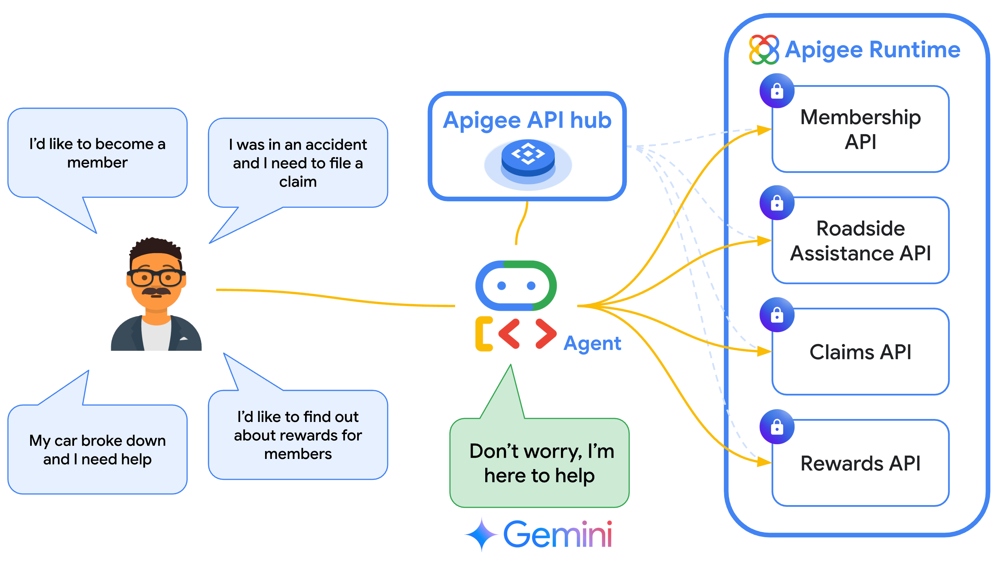

# Auto insurance Agent using Apigee API hub

This sample provides a set of APIs designed to act as tools for an [AI agent](https://cloud.google.com/discover/what-are-ai-agents) for auto insurance.

This sample contains the following:

1. API specifications which act as the [tools](https://google.github.io/adk-docs/tools/) used by the agent.
    * These APIs are imported to [API hub](https://cloud.google.com/apigee/docs/apihub/what-is-api-hub) and then referenced in the agent code using ADK's built-in [ApiHubToolset](https://google.github.io/adk-docs/tools/google-cloud-tools/#apigee-api-hub-tools). This lets agent developers easily turn any existing API from their organization's API catalog into a tool with just a few lines of code.
2. An Apigee [Proxy](https://cloud.google.com/apigee/docs/api-platform/fundamentals/understanding-apis-and-api-proxies#whatisanapiproxy) implementation that serves the API responses to the agent.
    * This sample proxy implementation returns mock data generated using Gemini.

## (QuickStart) Deploying Apigee assets using CloudShell

Use the following GCP CloudShell tutorial, and follow the instructions.

